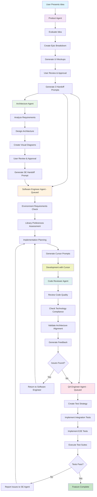
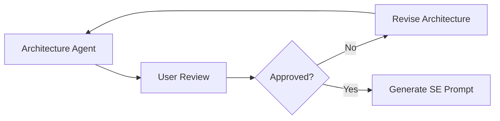
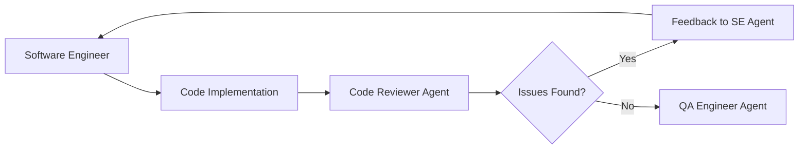
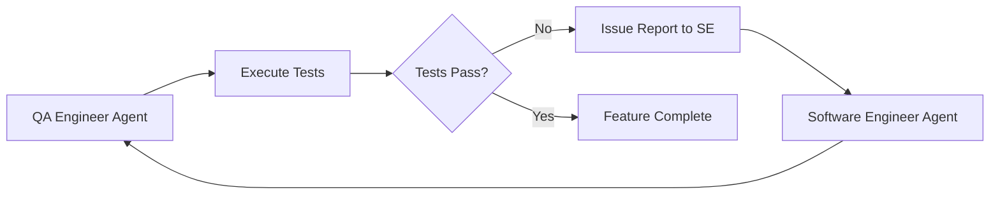

# AI-Agent-Project-Instruction-Generator

# Agent Development Ecosystem Workflow

## Overview
This document outlines the complete workflow and interactions between the five specialized agents in your development ecosystem, designed to take product ideas from concept to fully tested implementation.

## Agent Ecosystem Components

### 1. Product Manager/Product Owner Agent
**Role**: Idea evaluation and MVP planning
**Input**: Raw product ideas and domain context
**Output**: Structured epics, features, user stories, UI mockups, and three handoff prompts
**Sample**: [Agent Instructions](/Samples/Product%20Owner%20Agent%20Instructions.md)

### 2. Architecture Agent
**Role**: Technical architecture design and implementation oversight
**Input**: Product requirements from Product Agent
**Output**: Technical architecture plan with visual diagrams and Software Engineer handoff prompt
**Sample**: [Agent Instructions](/Samples/Architecture%20Agent%20Instructions.md)

### 3. Software Engineer Agent
**Role**: Implementation planning and Cursor prompt generation
**Input**: Architectural specifications and product requirements
**Output**: Development environment requirements and detailed Cursor implementation prompts
**Sample**: [Agent Instructions](/Samples/Software%20Engineer%20Agent%20Instructions.md)

### 4. Code Reviewer Agent
**Role**: Pull request-style code quality review
**Input**: Code implementations from Software Engineer Agent
**Output**: Structured feedback and improvement recommendations
**Sample**: [Agent Instructions](https://github.com/jnhaffey/AI-Agent-Project-Instruction-Generator/blob/main/Samples/Code%20Reviewer%20Agent%20Instructions.md)

### 5. QA Engineer Agent
**Role**: Integration and end-to-end testing validation
**Input**: User stories and implemented code
**Output**: Automated test suites and defect reports
**Sample**: [Agent Instructions](/Samples/QA%20Engineer%20Agent%20Instructions.md)

---

## Complete Workflow Diagram

---

## Detailed Agent Interaction Flow

### Phase 1: Product Planning

#### Product Agent Workflow
1. **Idea Intake**: Receives raw product idea and domain context
2. **Context Gathering**: Collects essential project information
3. **Idea Evaluation**: Assesses viability and market fit
4. **MVP Planning**: Creates structured epic breakdown
5. **UI Mockup Creation**: Generates basic interface mockups
6. **User Validation**: Presents plan for approval
7. **Multi-Agent Handoff**: Creates three specialized prompts

#### Product Agent Output
- **Architecture Agent Prompt**: Technical requirements with mandatory tech stack
- **Software Engineer Agent Prompt**: Implementation context (queued until architecture complete)
- **QA Engineer Agent Prompt**: Testing requirements (queued until implementation complete)

### Phase 2: Technical Architecture

#### Architecture Agent Workflow
1. **Requirements Analysis**: Reviews product specifications
2. **Architecture Design**: Creates technical architecture within constraints
3. **Technology Selection**: Chooses specific tools within mandatory stack
4. **Visual Documentation**: Generates architectural diagrams
5. **User Review**: Presents architecture for approval
6. **Software Engineer Handoff**: Creates detailed implementation prompt

#### Mandatory Technology Constraints
- **Backend**: .NET/C# (always)
- **Frontend**: React (always)
- **Authentication**: Auth0 (always)
- **Cloud Platform**: Azure (always)
- **Object Mapping**: Never AutoMapper
- **Testing**: xUnit for backend

#### Architecture Agent Output
- **System Architecture Diagrams**: Component relationships
- **Data Flow Diagrams**: Information movement patterns
- **Azure Services Diagrams**: Cloud integration patterns
- **Authentication Flow Diagrams**: Auth0 integration
- **Database Schema Diagrams**: Entity relationships

### Phase 3: Implementation Planning

#### Software Engineer Agent Workflow
1. **Environment Assessment**: Validates development setup requirements
2. **Library Preferences**: Confirms third-party library choices
3. **Architecture Integration**: Incorporates architectural specifications
4. **Implementation Planning**: Breaks down work into phases
5. **Cursor Prompt Generation**: Creates detailed implementation instructions

#### Development Environment Requirements
- **Solution Structure**: C:\Coding\Repos\[SolutionName]
- **Git Initialization**: Automatic repository setup
- **Containerization**: Docker containers for all executable projects
- **Local Emulators**: Cost-effective local development
- **Testing Setup**: xUnit for backend, Jest for frontend

#### Software Engineer Agent Output
- **Environment Checklist**: Development setup requirements
- **Cursor Prompts**: Granular implementation instructions
- **Container Configuration**: Docker and docker-compose setup
- **Testing Strategy**: Unit testing implementation plans

### Phase 4: Development & Review Cycle

#### Development Process
1. **Cursor Implementation**: Developer uses generated prompts
2. **Code Creation**: Features implemented according to specifications
3. **Local Testing**: Unit tests and local validation
4. **Code Review Submission**: Implementation ready for review

#### Code Reviewer Agent Workflow
1. **Code Quality Assessment**: Reviews implementation quality
2. **Technology Compliance**: Validates tech stack adherence
3. **Architecture Alignment**: Ensures architectural compliance
4. **Feedback Generation**: Creates structured improvement recommendations

#### Review Categories
- **🚨 Critical Issues**: Must fix before proceeding
- **⚠️ Major Issues**: Should fix for quality
- **💡 Minor Issues**: Nice to have improvements
- **✅ Positive Feedback**: Acknowledges good practices

### Phase 5: Quality Assurance

#### QA Engineer Agent Workflow
1. **Test Strategy Development**: Plans comprehensive testing approach
2. **Integration Testing**: Component interaction validation
3. **End-to-End Testing**: Complete user workflow testing
4. **Acceptance Criteria Validation**: Verifies product requirements
5. **Issue Reporting**: Documents defects for resolution

#### Testing Framework Strategy
- **Backend API Testing**: RestSharp + xUnit
- **Frontend Testing**: Playwright + Jest or Cypress
- **Consistency**: Maintains same frameworks throughout project
- **Local Focus**: Tests against local development environment

#### QA Agent Output
- **Test Suites**: Automated integration and E2E tests
- **Test Reports**: Execution results and coverage analysis
- **Issue Reports**: Structured defect documentation
- **Regression Tests**: Ongoing quality validation

---

## Feedback Loops & Iteration Cycles

### Primary Feedback Loops

#### Architecture Review Loop

#### Development Quality Loop

#### Testing Feedback Loop

### Integration Points

#### Cross-Agent Communication
- **Product → Architecture**: Product requirements and constraints
- **Architecture → Software Engineer**: Technical specifications and patterns
- **Software Engineer → Code Reviewer**: Implementation for quality validation
- **Software Engineer → QA Engineer**: Completed features for testing
- **Code Reviewer → Software Engineer**: Quality feedback and improvements
- **QA Engineer → Software Engineer**: Defect reports and test failures

#### User Interaction Points
- **Product Agent**: Idea validation and epic approval
- **Architecture Agent**: Architecture review and approval
- **Software Engineer Agent**: Environment setup and library preferences
- **Development Process**: Cursor prompt execution and implementation
- **Final Delivery**: Tested, reviewed, and validated features

---

## Technology Stack Compliance

### Mandatory Technology Rules
All agents enforce these non-negotiable constraints:

1. **Backend**: .NET/C# exclusively
2. **Frontend**: React exclusively  
3. **Authentication**: Auth0 exclusively
4. **Cloud Platform**: Azure exclusively
5. **Object Mapping**: Never AutoMapper
6. **Testing**: xUnit for backend, Jest for frontend
7. **Containerization**: Lightweight Linux containers
8. **Source Control**: Git with comprehensive .gitignore

### Quality Gates
- **Product Agent**: User story validation and UI mockup approval
- **Architecture Agent**: Technical architecture review and diagram validation
- **Code Reviewer Agent**: Code quality and technology compliance validation
- **QA Engineer Agent**: Acceptance criteria and user workflow validation

---

## Benefits of the Agent Ecosystem

### Comprehensive Coverage
- **Product Strategy**: Clear requirements and user-focused design
- **Technical Architecture**: Robust, scalable system design
- **Implementation Quality**: Professional code standards and practices
- **Testing Validation**: Comprehensive quality assurance

### Consistency & Standards
- **Technology Stack**: Enforced compliance across all projects
- **Code Quality**: Consistent review standards and feedback
- **Testing Strategy**: Standardized testing approaches and frameworks
- **Documentation**: Clear specifications and visual representations

### Cost Efficiency
- **Local Development**: Minimal cloud costs during development
- **Containerization**: Consistent environments and easy deployment
- **Automation**: Reduced manual effort through agent coordination
- **Quality Prevention**: Early issue detection prevents costly rework

### Scalability
- **Team Coordination**: Clear handoffs and responsibilities
- **Knowledge Capture**: Documented decisions and architectural patterns
- **Reusable Components**: Consistent patterns across projects
- **Future Maintenance**: Well-documented, tested, and reviewed code

---

## Getting Started

### Initial Setup
1. Configure all five agents with their respective instructions
2. Ensure development environment meets Software Engineer Agent requirements
3. Set up Auth0 development tenant and Azure account
4. Install Docker Desktop and development tools

### First Project Workflow
1. **Start with Product Agent**: Present your product idea
2. **Review Architecture**: Approve technical architecture and diagrams  
3. **Confirm Environment**: Validate development setup requirements
4. **Begin Development**: Use generated Cursor prompts for implementation
5. **Iterate Through Reviews**: Address feedback from Code Reviewer Agent
6. **Validate with Testing**: Ensure QA Engineer Agent tests pass
7. **Deploy and Scale**: Move from local containers to Azure cloud

This ecosystem provides a complete, professional development workflow that takes ideas from concept to production-ready implementation while maintaining high quality standards and cost efficiency.