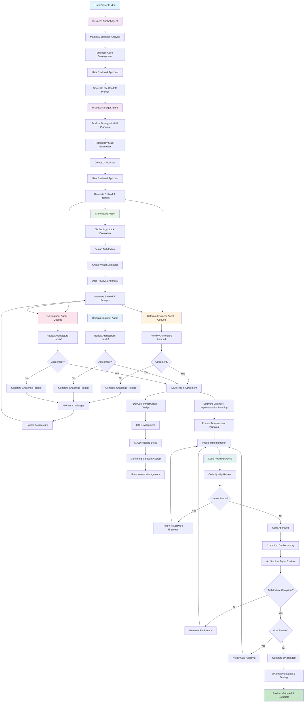
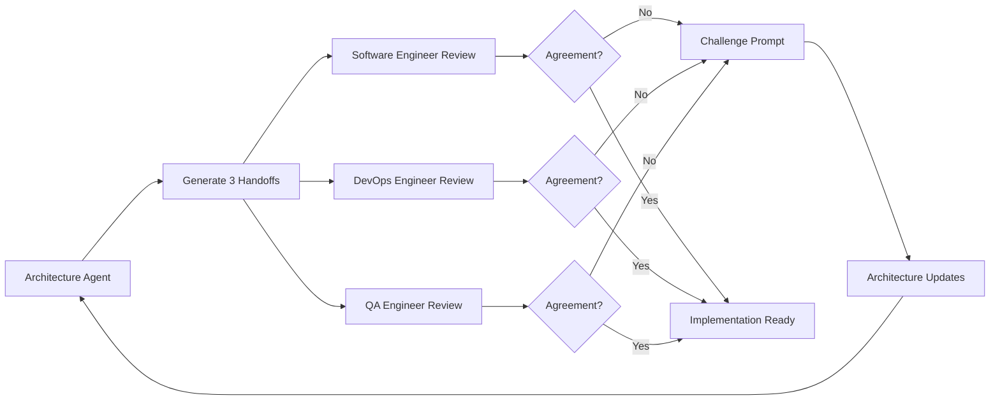
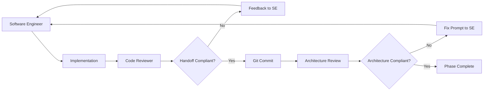
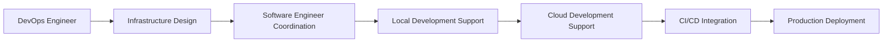

# Agent Development Ecosystem Workflow

## Overview
This document outlines the complete workflow and interactions between the six specialized agents in your development ecosystem, designed to take product ideas from concept to fully tested implementation with comprehensive validation, quality assurance, and production-ready infrastructure.

## Interactive Claude Artifact
An interactive version of these Agent Instructions is available in Claude.

[Open the interactive Claude Artifact](https://claude.ai/public/artifacts/9979554b-27b7-4510-ac40-37f62a763ec7)

## Agent Ecosystem Components

### 1. Business Analyst Agent
**Role**: Market feasibility, monetization assessment, and business case development
**Input**: Raw product ideas and market context
**Output**: Business case analysis and Product Manager handoff prompt

### 2. Product Manager/Product Owner Agent
**Role**: Product strategy, MVP planning, and requirements definition
**Input**: Business case from Business Analyst Agent
**Output**: Product requirements, UI mockups, and THREE handoff prompts

### 3. Architecture Agent
**Role**: Technical architecture design, implementation oversight, and multi-agent coordination
**Input**: Product requirements from Product Manager Agent
**Output**: Technical architecture plan with visual diagrams and THREE handoff prompts

### 4. Software Engineer Agent
**Role**: Implementation planning, TDD development, and code structure design
**Input**: Architecture specifications and challenge/collaboration cycle
**Output**: Phased implementation with comprehensive testing and documentation

### 5. DevOps Engineer Agent
**Role**: Infrastructure as code, CI/CD pipelines, monitoring, security automation, and environment management
**Input**: Architecture specifications and challenge/collaboration cycle
**Output**: Production-ready infrastructure and deployment automation

### 6. QA Engineer Agent
**Role**: Product validation, integration testing, and end-to-end testing
**Input**: Architecture specifications, implementation summaries, and challenge/collaboration cycle
**Output**: Automated test suites and product validation reports

### 7. Code Reviewer Agent
**Role**: Code quality review and compliance validation
**Input**: Implementation code and handoff specifications
**Output**: Quality feedback and approval validation

---

## Complete Workflow Diagram


---

## Detailed Agent Interaction Flow

### Phase 1: Business Analysis & Validation

#### Business Analyst Agent Workflow
1. **Market Analysis**: Conduct comprehensive market research and competitive analysis
2. **Business Case Development**: Assess monetization potential and financial viability
3. **Risk Assessment**: Evaluate market, technology, and financial risks
4. **Go/No-Go Recommendation**: Provide clear business recommendation
5. **User Validation**: Present business case for approval
6. **Product Manager Handoff**: Generate business-validated handoff prompt

#### Business Analyst Agent Output
- **Product Manager Agent Prompt**: `AGENT TYPE: PRODUCT MANAGER AGENT` - Business context with market opportunity and recommended business model

### Phase 2: Product Strategy & Requirements

#### Product Manager Agent Workflow
1. **Business Context Integration**: Incorporate business analysis findings into product strategy
2. **Technology Stack Evaluation**: Assess if default technology stack is optimal for business objectives
3. **MVP Planning**: Create structured epic breakdown with themes, features, and user stories
4. **UI Mockup Creation**: Generate basic interface mockups for all user-facing components
5. **User Validation**: Present complete product plan for approval
6. **Multi-Agent Handoff**: Create THREE specialized prompts with Agent Type labels

#### Product Manager Agent Output
- **Architecture Agent Prompt**: `AGENT TYPE: ARCHITECTURE AGENT` - Product requirements with business context and confirmed technology stack
- **Software Engineer Agent Prompt**: `AGENT TYPE: SOFTWARE ENGINEER AGENT` - Implementation context with UI mockup references (queued until architecture complete)
- **QA Engineer Agent Prompt**: `AGENT TYPE: QA ENGINEER AGENT` - Testing requirements with UI validation needs (queued until architecture complete)

### Phase 3: Technical Architecture & Multi-Agent Coordination

#### Architecture Agent Workflow
1. **Technology Stack Evaluation**: Assess default stack and recommend alternatives when beneficial
2. **Requirements Analysis**: Review product specifications and UI mockups with confirmed technology stack
3. **Architecture Design**: Create technical architecture within confirmed technology constraints
4. **Visual Documentation**: Generate architectural diagrams using Mermaid
5. **User Review**: Present architecture and diagrams for approval
6. **Multi-Agent Handoff**: Create THREE detailed handoff prompts for implementation agents

#### Architecture Agent Output
- **Software Engineer Agent Handoff**: `AGENT TYPE: SOFTWARE ENGINEER AGENT` with complete specifications
- **DevOps Engineer Agent Handoff**: `AGENT TYPE: DEVOPS ENGINEER AGENT` with infrastructure requirements
- **QA Engineer Agent Handoff**: `AGENT TYPE: QA ENGINEER AGENT` with architecture behavior specifications

### Phase 4: Challenge & Agreement Cycle (NEW)

#### Multi-Agent Review Process
1. **Simultaneous Review**: Software Engineer, DevOps Engineer, and QA Engineer Agents review architecture handoff
2. **Individual Assessment**: Each agent evaluates handoff against their domain expertise
3. **Challenge Generation**: Agents generate challenge prompts if concerns exist
4. **Architecture Response**: Architecture Agent addresses challenges and updates specifications
5. **Iterative Refinement**: Cycle continues until all agents are in agreement
6. **Final Agreement**: All agents confirm readiness to proceed

#### Challenge Prompt Structure
```
# AGENT TYPE: ARCHITECTURE AGENT
# [Agent Name] Challenge Prompt: [Issue/Concern Title]

## Domain-Specific Concerns
[Specific concerns from agent's perspective]

## Impact Assessment
[How concerns affect implementation/infrastructure/testing]

## Recommended Solutions
[Suggested architectural modifications]

## Questions for Architecture Agent
[Specific questions requiring clarification]
```

#### Agreement Confirmation Structure
```
# AGENT TYPE: ARCHITECTURE AGENT
# [Agent Name] Agreement Confirmation: [Project Name]

## Architecture Review Complete
[Confirmation that specifications are acceptable]

## Ready to Proceed
[Specific capabilities ready for implementation]
```

### Phase 5: Infrastructure & Implementation Preparation

#### DevOps Engineer Agent Workflow (NEW)
1. **Infrastructure Technology Evaluation**: Assess infrastructure stack and recommend alternatives
2. **Infrastructure as Code Design**: Create comprehensive infrastructure definitions
3. **CI/CD Pipeline Design**: Plan automated build, test, and deployment pipelines
4. **Monitoring Strategy**: Design application and infrastructure monitoring
5. **Security Automation**: Plan automated security controls and compliance
6. **Environment Management**: Design development, staging, and production environments
7. **Software Engineer Coordination**: Collaborate on local and cloud development support

#### Software Engineer Agent Workflow (Updated)
1. **Implementation Technology Evaluation**: Assess implementation stack and recommend alternatives
2. **Environment Assessment**: Validate development setup requirements
3. **Library Preferences**: Confirm third-party library choices
4. **Architecture Integration**: Incorporate architectural specifications
5. **Phase Planning**: Break work into logical phases and present plan for approval
6. **DevOps Coordination**: Work with DevOps Engineer on deployment strategies

### Phase 6: Phased Implementation & Quality Assurance

#### Implementation Cycle
1. **Phase Execution**: Software Engineer Agent provides ONE phase prompt at a time
2. **TDD Implementation**: Follow Test-Driven Development methodology
3. **Code Review**: Code Reviewer Agent validates implementation against handoff specifications
4. **Iterative Refinement**: Fix issues until Code Reviewer approval achieved
5. **Git Commit**: Code committed to repository after approval
6. **Architecture Validation**: Architecture Agent reviews committed code for compliance
7. **Phase Completion**: User approval before proceeding to next phase

#### Quality Assurance Integration
- **Code Quality**: Code Reviewer Agent ensures handoff compliance and coding standards
- **Architecture Compliance**: Architecture Agent validates implementation matches specifications
- **Infrastructure Readiness**: DevOps Engineer Agent ensures infrastructure supports implementation
- **Testing Preparation**: QA Engineer Agent receives implementation summaries for test planning

### Phase 7: Product Validation & Testing

#### QA Engineer Agent Workflow (Updated)
1. **Testing Technology Evaluation**: Assess testing stack and recommend alternatives
2. **Implementation Summary Review**: Receive summary from Software Engineer Agent
3. **Test Strategy Development**: Create comprehensive testing approach using confirmed testing frameworks
4. **Product Validation**: Test implemented product against all requirements
5. **UI Validation**: Test UI against Product Manager mockups using confirmed UI testing framework
6. **Architecture Behavior Testing**: Validate product behavior against Architecture specifications
7. **Integration Testing**: Comprehensive component interaction testing

---

## Key Integration Points & Feedback Loops

### Primary Feedback Loops

#### Challenge & Agreement Loop (NEW)


#### Implementation Quality Loop (Updated)


#### Infrastructure Integration Loop (NEW)


### Cross-Agent Communication

#### Agent Type Labels for Clear Routing
- **`AGENT TYPE: BUSINESS ANALYST AGENT`**: Market analysis and business case handoff
- **`AGENT TYPE: PRODUCT MANAGER AGENT`**: Product requirements and business context
- **`AGENT TYPE: ARCHITECTURE AGENT`**: Technical specifications, challenges, and updates
- **`AGENT TYPE: SOFTWARE ENGINEER AGENT`**: Implementation specifications, fixes, and summaries
- **`AGENT TYPE: DEVOPS ENGINEER AGENT`**: Infrastructure requirements and coordination
- **`AGENT TYPE: QA ENGINEER AGENT`**: Testing requirements and validation needs
- **`AGENT TYPE: CODE REVIEWER AGENT`**: Quality assurance and compliance feedback

#### Integration Points
- **Business Analyst → Product Manager**: Market analysis and business model recommendations
- **Product Manager → Architecture**: Product requirements with business context and technology stack
- **Architecture → Software Engineer/DevOps/QA**: Technical specifications with challenge/agreement cycle
- **Software Engineer ↔ DevOps Engineer**: Local and cloud development coordination
- **Software Engineer → Code Reviewer**: Implementation validation and quality assurance
- **Architecture ← Software Engineer/DevOps/QA**: Challenge prompts and agreement confirmations
- **Code Reviewer → Software Engineer**: Quality feedback and compliance validation
- **Architecture → Software Engineer**: Architecture compliance validation and fix prompts
- **Software Engineer → QA Engineer**: Implementation summary and testing handoff

#### User Interaction Points
- **Business Analyst Agent**: Business case validation and Go/No-Go decisions
- **Product Manager Agent**: Product strategy validation, technology stack confirmation, and UI mockup review
- **Architecture Agent**: Architecture review, technology stack confirmation, and challenge resolution
- **DevOps Engineer Agent**: Infrastructure technology stack confirmation and operational requirements
- **Software Engineer Agent**: Implementation technology stack confirmation, environment setup, and phase approvals
- **QA Engineer Agent**: Testing technology stack confirmation and testing scope validation
- **Development Process**: Phase-by-phase implementation with quality gates
- **Final Delivery**: Business-validated, tested, and production-ready solution

---

## Technology Stack Evolution & Compliance

### Technology Stack Evaluation Points
1. **Product Manager Agent**: Evaluates stack against business objectives and market requirements
2. **Architecture Agent**: Evaluates stack against technical architecture and system requirements
3. **Software Engineer Agent**: Evaluates stack against implementation productivity and development requirements
4. **DevOps Engineer Agent**: Evaluates stack against infrastructure and operational requirements
5. **QA Engineer Agent**: Evaluates stack against testing framework compatibility and effectiveness

### Technology Consistency Enforcement
- **User Approval Gates**: All technology stack changes require explicit user approval
- **Cross-Agent Alignment**: Technology decisions propagate through all downstream agents
- **Documentation Updates**: All agents update processes based on confirmed technology stack
- **Integration Validation**: Technology choices validated across the entire ecosystem

### Quality Gates & Validation Points
- **Business Analyst Agent**: Market viability and business model validation
- **Product Manager Agent**: Product strategy validation and technology stack confirmation
- **Architecture Agent**: Technical architecture review with challenge/agreement cycle
- **Software Engineer Agent**: Phase-by-phase development with quality validation
- **DevOps Engineer Agent**: Infrastructure compliance and operational excellence validation
- **Code Reviewer Agent**: Implementation quality and handoff compliance validation
- **QA Engineer Agent**: Product validation against requirements and architectural specifications

---

## Development Workflow Example

### Complete Project Flow
1. **User presents idea** → Business Analyst Agent evaluates market and business viability
2. **Business case validation** → User approves business opportunity and monetization strategy
3. **Product Manager creates strategy** → Product requirements, technology evaluation, and UI mockups
4. **Product strategy approval** → User confirms product approach and technology stack
5. **Architecture Agent designs system** → Technical specifications with confirmed technology stack
6. **Architecture approval** → User validates architectural approach and visual diagrams
7. **Multi-agent handoff** → Architecture Agent generates three handoff prompts
8. **Challenge & agreement cycle** → Software Engineer, DevOps Engineer, and QA Engineer review and challenge if needed
9. **Final agreement** → All agents confirm readiness to proceed with implementation
10. **Infrastructure preparation** → DevOps Engineer designs IaC, CI/CD, monitoring, and security
11. **Implementation planning** → Software Engineer creates phase plan with DevOps coordination
12. **Phase implementation** → TDD development with Code Reviewer validation
13. **Architecture validation** → Architecture Agent reviews committed code for compliance
14. **Iterative development** → Repeat implementation cycle for all phases
15. **QA validation** → QA Engineer validates complete product against all requirements
16. **Production deployment** → DevOps Engineer enables production deployment with monitoring
17. **Project complete** → Fully tested, documented, and production-ready solution

### Key Success Factors

#### Comprehensive Coverage with Business Validation
- **Market Analysis**: Thorough feasibility assessment before product development
- **Business Model Alignment**: Revenue strategy integrated throughout development
- **Technology Optimization**: Stack evaluation at multiple points for optimal choices
- **Product Strategy**: Clear requirements and user-focused design with visual mockups
- **Technical Architecture**: Robust, scalable system design with multi-agent validation
- **Infrastructure Excellence**: Production-ready infrastructure with automation and monitoring
- **Implementation Quality**: Professional code standards with TDD methodology
- **Product Validation**: Comprehensive quality assurance against all requirements

#### Enhanced Collaboration & Validation
- **Challenge-Driven Architecture**: Multi-agent review prevents downstream issues
- **Technology Stack Consensus**: All agents align on optimal technology choices
- **Iterative Refinement**: Multiple validation points ensure quality at each stage
- **Cross-Agent Coordination**: Software Engineer and DevOps Engineer collaboration ensures seamless development
- **Quality Assurance**: Multiple review layers ensure implementation compliance

#### Operational Excellence
- **Infrastructure as Code**: Reproducible, version-controlled infrastructure
- **CI/CD Automation**: Automated build, test, and deployment pipelines
- **Monitoring and Security**: Comprehensive observability and automated security controls
- **Environment Management**: Consistent development, staging, and production environments
- **Cloud Cost Optimization**: DevOps Engineer responsible for maintaining cost-effective infrastructure
- **Local and Cloud Support**: Seamless development experience across environments
- **Latest Technology Stack**: Always using latest stable versions of all libraries and frameworks
- **Comprehensive Change Tracking**: Complete changelog documentation for all modifications

#### Cost Efficiency & Control
- **Business Validation**: Ideas validated for viability before development investment
- **Technology Optimization**: Stack choices optimized for both capability and cost
- **Local Development**: Minimal cloud costs during development phase
- **Automated Operations**: Reduced operational overhead through automation
- **Phased Approach**: User control over development progression with quality gates

---

## Benefits of the Enhanced Agent Ecosystem

### Superior Business Value
- **Market-Driven Development**: All projects validated for business opportunity and competitive advantage
- **Technology-Business Alignment**: Technology choices optimized for business objectives
- **Revenue Model Integration**: Business models supported throughout entire development and infrastructure
- **Operational Excellence**: Production-ready infrastructure with monitoring, security, and automation

### Enhanced Quality Control
- **Multi-Point Validation**: Business, product, architecture, implementation, infrastructure, and testing validation
- **Challenge-Driven Architecture**: Proactive issue identification through multi-agent review
- **Technology Consensus**: All agents align on optimal technology choices for their domains
- **Quality Gates**: Multiple validation points ensure quality at each development stage

### Improved Efficiency & Collaboration
- **Proactive Issue Resolution**: Challenge and agreement cycle prevents downstream problems
- **Technology Optimization**: Stack evaluation at multiple points ensures optimal choices
- **Cross-Agent Coordination**: Software Engineer and DevOps Engineer collaboration eliminates integration issues
- **Automated Operations**: Infrastructure automation reduces operational overhead
- **Parallel Preparation**: Multiple agents can work simultaneously within coordinated workflow

### Production Readiness
- **Infrastructure Excellence**: Production-ready infrastructure from day one
- **Deployment Automation**: Automated CI/CD pipelines for reliable deployments
- **Monitoring and Security**: Comprehensive observability and security automation
- **Environment Consistency**: Identical environments from development to production
- **Operational Support**: Full monitoring, alerting, and incident response capabilities

### Risk Mitigation
- **Business Feasibility**: Market and financial viability confirmed before development
- **Technology Validation**: Technology choices validated across all agent domains
- **Architecture Review**: Multi-agent challenge process identifies issues early
- **Quality Assurance**: Implementation compliance validated at multiple levels
- **Operational Readiness**: Infrastructure and deployment risks addressed proactively

This enhanced agent ecosystem provides a complete, professional development workflow that takes raw business ideas from initial concept through market validation to production-ready implementation while maintaining high quality standards, business viability, operational excellence, cost efficiency, and user control throughout the entire process.