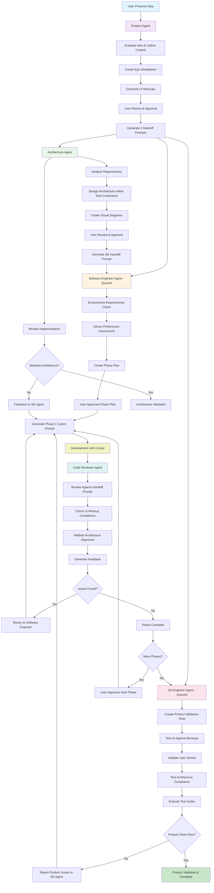
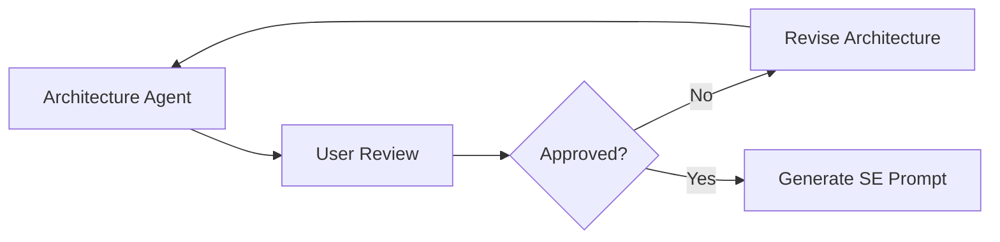
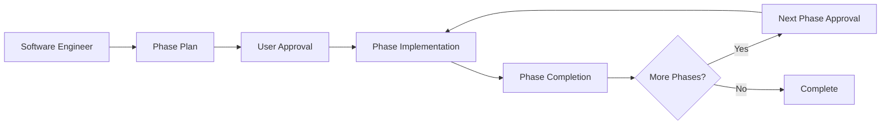
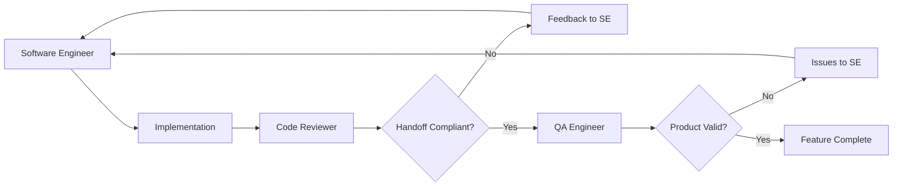

# Agent Development Ecosystem Workflow

## Overview
This document outlines the complete workflow and interactions between the five specialized agents in your development ecosystem, designed to take product ideas from concept to fully tested implementation with comprehensive validation and quality assurance.

## Agent Ecosystem Components

### 1. Product Manager/Product Owner Agent
**Role**: Idea evaluation, MVP planning, and multi-agent coordination
**Input**: Raw product ideas and domain context
**Output**: Structured epics/features/user stories, UI mockups, and THREE handoff prompts

### 2. Architecture Agent
**Role**: Technical architecture design, implementation oversight, and code validation
**Input**: Product requirements from Product Agent
**Output**: Technical architecture plan with visual diagrams, Software Engineer handoff prompt, and code compliance validation

### 3. Software Engineer Agent
**Role**: Phased implementation planning, TDD development, and Cursor prompt generation
**Input**: Architectural specifications and product requirements
**Output**: Development environment requirements, phased Cursor implementation prompts, and comprehensive documentation

### 4. Code Reviewer Agent
**Role**: Pull request-style code quality review against handoff specifications
**Input**: Code implementations and Software Engineer handoff prompts
**Output**: Structured feedback and compliance validation reports

### 5. QA Engineer Agent
**Role**: Product validation, integration testing, and end-to-end testing
**Input**: User stories, UI mockups, and implemented products
**Output**: Automated test suites, product validation reports, and defect reports

---

## Complete Workflow Diagram

---

## Detailed Agent Interaction Flow

### Phase 1: Product Planning & Requirements

#### Product Agent Workflow
1. **Idea Intake**: Receives raw product idea and domain context
2. **Context Gathering**: Collects essential project information (domain, users, goals, constraints)
3. **Idea Evaluation**: Assesses viability, market fit, and MVP scope
4. **MVP Planning**: Creates structured epic breakdown with themes, features, and user stories
5. **UI Mockup Creation**: Generates basic interface mockups for all user-facing components
6. **User Validation**: Presents complete plan for approval
7. **Multi-Agent Handoff**: Creates THREE specialized prompts with Agent Type labels

#### Product Agent Output
- **Architecture Agent Prompt**: `AGENT TYPE: ARCHITECTURE AGENT` - Technical requirements with mandatory tech stack
- **Software Engineer Agent Prompt**: `AGENT TYPE: SOFTWARE ENGINEER AGENT` - Implementation context with UI mockup references (queued until architecture complete)
- **QA Engineer Agent Prompt**: `AGENT TYPE: QA ENGINEER AGENT` - Testing requirements with UI validation needs (queued until implementation complete)

### Phase 2: Technical Architecture & Design

#### Architecture Agent Workflow
1. **Requirements Analysis**: Reviews product specifications and UI mockups
2. **Architecture Design**: Creates technical architecture within mandatory constraints
3. **Technology Selection**: Chooses specific tools within established technology stack
4. **Visual Documentation**: Generates architectural diagrams using Mermaid
5. **User Review**: Presents architecture and diagrams for approval
6. **Software Engineer Handoff**: Creates detailed implementation prompt

#### Mandatory Technology Constraints (Non-Negotiable)
- **Backend**: .NET/C# (always)
- **Frontend**: React (always)
- **Authentication**: Auth0 (always)
- **Cloud Platform**: Azure (always)
- **Object Mapping**: Never AutoMapper
- **Testing**: xUnit for backend

#### Architecture Agent Output
- **System Architecture Diagrams**: Component relationships and interactions
- **Data Flow Diagrams**: Information movement patterns
- **Azure Services Diagrams**: Cloud integration patterns
- **Authentication Flow Diagrams**: Auth0 integration workflows
- **Database Schema Diagrams**: Entity relationships
- **Software Engineer Handoff**: `AGENT TYPE: SOFTWARE ENGINEER AGENT` with complete specifications

### Phase 3: Phased Implementation Planning & Execution

#### Software Engineer Agent Workflow
1. **Environment Assessment**: Validates development setup requirements
2. **Library Preferences**: Confirms third-party library choices
3. **Architecture Integration**: Incorporates architectural specifications
4. **Phase Planning**: Breaks work into logical phases and presents plan for approval
5. **Phase Execution**: Provides ONE phase prompt at a time
6. **User Feedback**: Waits for approval before proceeding to next phase
7. **TDD Implementation**: Generates Cursor prompts following Test-Driven Development

#### Phased Development Structure
**Phase 1: Foundation & Setup**
- Solution creation in C:\Coding\Repos\[SolutionName]
- Git initialization with comprehensive .gitignore
- Documentation setup (README.md + docs/ folder)
- Containerization with lightweight Linux containers
- Test infrastructure setup

**Phase 2: Core Infrastructure**
- Database schema implementation
- Auth0 authentication integration
- Basic API structure and React foundation
- Core services and integration testing setup

**Phase 3: Feature Implementation (Sub-phases)**
- Individual user story/epic implementation
- UI components matching Product Agent mockups exactly
- TDD implementation with comprehensive testing
- Documentation updates

**Phase 4: Integration & Polish**
- Component integration and error handling
- Performance optimization and UI refinement
- Final documentation and deployment preparation

#### Software Engineer Agent Output
- **Environment Checklist**: Development setup requirements
- **Cursor Prompts**: `AGENT TYPE: CURSOR` with TDD implementation instructions
- **Container Configuration**: Docker and docker-compose setup
- **Documentation**: Technical README.md and user guides in docs/ folder
- **Phase Completion Reports**: Status updates requiring user approval

### Phase 4: Quality Assurance & Code Review

#### Code Reviewer Agent Workflow
1. **Handoff Prompt Review**: Obtains and reviews the most recent Software Engineer handoff prompt
2. **Code Quality Assessment**: Reviews implementation quality and standards compliance
3. **Handoff Compliance**: Validates implementations match handoff specifications (PRIMARY FOCUS)
4. **UI Mockup Validation**: Ensures UI implementations match Product Agent mockups
5. **Architecture Alignment**: Verifies compliance with Architecture Agent specifications
6. **Feedback Generation**: Creates structured improvement recommendations

#### Review Categories
- **🚨 Critical Issues**: Handoff prompt violations, security vulnerabilities, breaking changes
- **⚠️ Major Issues**: Partial compliance, code quality issues, performance problems
- **💡 Minor Issues**: Style inconsistencies, optimization opportunities
- **✅ Positive Feedback**: Successful compliance and good practices

#### Code Reviewer Agent Output
- **Compliance Reports**: `AGENT TYPE: SOFTWARE ENGINEER AGENT` with handoff validation
- **Issue Documentation**: Specific problems and solutions
- **Architecture Escalation**: Critical issues requiring Architecture Agent input

#### Architecture Agent Code Validation
1. **Implementation Review**: Validates code matches architectural specifications
2. **Technology Compliance**: Ensures mandatory technology rules are followed
3. **Design Pattern Validation**: Verifies architectural patterns are correctly implemented
4. **Integration Verification**: Confirms components integrate as specified
5. **Feedback Provision**: Provides technical guidance for improvements

### Phase 5: Product Validation & Testing

#### QA Engineer Agent Workflow
1. **Product Analysis**: Reviews user stories, UI mockups, and architectural specifications
2. **Test Strategy Development**: Plans comprehensive product validation approach
3. **UI Validation**: Tests implemented UI against Product Agent mockups exactly
4. **User Story Testing**: Validates all acceptance criteria are met
5. **Architecture Behavior Testing**: Ensures product behavior aligns with Architecture specifications
6. **Integration Testing**: Comprehensive component interaction testing
7. **Issue Reporting**: Documents product defects for Software Engineer resolution

#### Testing Framework Strategy
- **Backend API Testing**: RestSharp + xUnit for .NET integration testing
- **Frontend Testing**: Playwright + Jest or Cypress for React automation
- **Product Validation**: UI mockup compliance and user workflow testing
- **Consistency**: Maintains same frameworks throughout project
- **Local Focus**: Tests against local development environment initially

#### QA Agent Output
- **Test Suites**: Automated integration, E2E, and product validation tests
- **Product Validation Reports**: UI compliance and user story verification
- **Issue Reports**: `AGENT TYPE: SOFTWARE ENGINEER AGENT` with product defects
- **Architecture Validation**: Product behavior compliance with specifications

---

## Key Integration Points & Feedback Loops

### Primary Feedback Loops

#### Architecture Review Loop

#### Phased Development Loop

#### Quality Assurance Loop

### Cross-Agent Communication

#### Agent Type Labels for Clear Routing
- **`AGENT TYPE: PRODUCT MANAGER AGENT`**: Business analysis handoff with market context
- **`AGENT TYPE: ARCHITECTURE AGENT`**: Product requirements and constraints
- **`AGENT TYPE: SOFTWARE ENGINEER AGENT`**: Implementation specifications, feedback, and issues
- **`AGENT TYPE: QA ENGINEER AGENT`**: Testing requirements and validation needs
- **`AGENT TYPE: CURSOR`**: Direct implementation prompts for development

#### Integration Points
- **Business Analyst → Product Manager**: Market analysis and business model recommendations
- **Product Manager → Architecture**: Requirements with mandatory technology constraints and business context
- **Architecture → Software Engineer**: Technical specifications with visual diagrams
- **Product Manager → Software Engineer**: UI mockups and user experience requirements
- **Product Manager → QA Engineer**: User stories and UI validation requirements
- **Architecture → QA Engineer**: Technical behavior specifications
- **Code Reviewer → Software Engineer**: Handoff compliance feedback
- **QA Engineer → Software Engineer**: Product validation feedback
- **Architecture ↔ Software Engineer**: Ongoing architectural compliance validation

#### User Interaction Points
- **Business Analyst Agent**: Market scope clarification, business model validation, and viability decisions
- **Product Manager Agent**: Product strategy validation, epic approval, and UI mockup review
- **Architecture Agent**: Architecture review, diagram approval, and technology validation
- **Software Engineer Agent**: Environment setup, library preferences, and phase approvals
- **Development Process**: Cursor prompt execution and phase-by-phase implementation
- **Final Delivery**: Market-validated, tested, and documented features
- **Development Process**: Cursor prompt execution and phase-by-phase implementation
- **Final Delivery**: Validated, tested, and documented features

---

## Technology Stack Compliance

### Mandatory Technology Rules (Enforced by All Agents)
All agents enforce these non-negotiable constraints:

1. **Backend**: .NET/C# exclusively (ASP.NET Core recommended)
2. **Frontend**: React exclusively for web applications
3. **Authentication**: Auth0 exclusively (never local authentication)
4. **Cloud Platform**: Azure exclusively for hosting and services
5. **Object Mapping**: Never AutoMapper (manual mapping required)
6. **Testing**: xUnit for backend, Jest for frontend
7. **Containerization**: Lightweight Linux containers for all executable projects
8. **Source Control**: Git with comprehensive .gitignore for Visual Studio and React
9. **Local Development**: Use emulators and local services to minimize cloud costs
10. **Documentation**: Comprehensive README.md (technical) + docs/ folder (user guides)

### Quality Gates & Validation Points
- **Product Agent**: User story validation and UI mockup approval
- **Architecture Agent**: Technical architecture review with visual diagram validation
- **Software Engineer Agent**: Phase-by-phase development with user approval gates
- **Code Reviewer Agent**: Handoff prompt compliance and code quality validation
- **QA Engineer Agent**: Product validation against user stories and UI mockups
- **Architecture Agent**: Ongoing code validation against architectural specifications

---

## Development Workflow Example

### Complete Project Flow
1. **User presents idea** → Product Agent evaluates and creates structured requirements
2. **Product Agent creates UI mockups** → Visual representation of user experience
3. **Product Agent generates 3 handoff prompts** → Parallel agent preparation
4. **Architecture Agent designs system** → Technical specifications with diagrams
5. **User approves architecture** → Gate before implementation begins
6. **Software Engineer creates phase plan** → Logical development breakdown
7. **User approves phase plan** → Gate before development starts
8. **Phase 1 implementation** → Foundation setup with TDD
9. **Code Reviewer validates Phase 1** → Handoff compliance check
10. **User approves Phase 1** → Gate before Phase 2
11. **Repeat for all phases** → Incremental development with validation
12. **QA Engineer validates product** → Complete product testing
13. **Architecture Agent validates implementation** → Final architectural compliance
14. **Project complete** → Fully tested, documented, and validated product

### Key Success Factors

#### Comprehensive Coverage with Business Validation
- **Market Analysis**: Thorough feasibility assessment before product development
- **Business Model Alignment**: Revenue strategy integrated throughout development
- **Product Strategy**: Clear requirements and user-focused design with visual mockups
- **Technical Architecture**: Robust, scalable system design with mandatory technology compliance
- **Implementation Quality**: Professional code standards with TDD methodology
- **Product Validation**: Comprehensive quality assurance against all requirements

#### Consistency & Standards
- **Business Model Focus**: Prioritized revenue models enforced across all development
- **Technology Stack**: Enforced compliance across all projects and agents
- **Code Quality**: Consistent review standards and feedback mechanisms
- **Testing Strategy**: Standardized testing approaches and frameworks
- **Documentation**: Clear specifications and visual representations at all levels

#### Cost Efficiency & Control
- **Market Validation**: Ideas validated for viability before development investment
- **Local Development**: Minimal cloud costs during development phase
- **Phased Approach**: User control over development progression
- **Containerization**: Consistent environments and easy deployment
- **Automation**: Reduced manual effort through agent coordination

#### Quality Assurance & Validation
- **Business Case Validation**: Market opportunity and monetization potential confirmed
- **Multi-Level Review**: Business, product, architecture, code, and functionality validation
- **Visual Consistency**: UI implementations match designed mockups exactly
- **Requirements Traceability**: All implementations trace back to original business case and requirements
- **Comprehensive Testing**: Product validation from multiple perspectives

---

## Benefits of the Integrated Agent Ecosystem

### Enhanced Business Value
- **Market-Driven Development**: All projects validated for business opportunity before development
- **Revenue Model Integration**: Business models considered throughout entire development cycle
- **Risk Mitigation**: Technology, market, and financial risks identified early
- **Competitive Positioning**: Market analysis ensures differentiated solutions

### Enhanced Quality Control
- **Multiple Validation Points**: Business, requirements, architecture, code, and product validation
- **Visual Consistency**: UI mockups ensure consistent user experience
- **Technology Compliance**: Mandatory stack ensures project consistency
- **Business Model Validation**: Products designed to support identified revenue streams

### Improved Efficiency
- **Early Filtering**: Non-viable ideas stopped before development investment
- **Clear Handoffs**: Agent Type labels enable proper routing and automation
- **Phased Development**: Controlled progression with user oversight
- **Parallel Preparation**: Multiple agents can prepare simultaneously
- **Automated Validation**: Consistent checking against specifications

### Risk Mitigation
- **Business Feasibility**: Market and financial viability confirmed before development
- **Early Architecture Review**: Technical issues caught before implementation
- **Phase-by-Phase Approval**: Issues addressed at each development stage
- **Handoff Compliance**: Implementations match specifications exactly
- **Product Validation**: Final product meets all original business and technical requirements

### Professional Standards
- **Business Case Documentation**: Comprehensive market analysis and business planning
- **Enterprise-Level Documentation**: Technical and user documentation maintained
- **Industry Best Practices**: TDD, proper architecture, comprehensive testing
- **Scalable Patterns**: Consistent approaches across all projects
- **Knowledge Capture**: Documented decisions, market analysis, and architectural patterns

This integrated agent ecosystem provides a complete, professional development workflow that takes raw business ideas from initial concept through market validation to production-ready implementation while maintaining high quality standards, business viability, cost efficiency, and user control throughout the entire process.